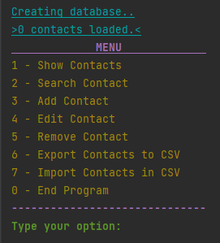

<h1 align="center">
  
   
  Contacts Manager:
</h1>

---

<h4 align="center">
Contacts manager with CRUD and import/export functions.
</h4>

---

Menu
=====

*If the program does not find the file 'database.csv', it will be created and loaded in the program, otherwise, it will be loaded and if there is any data inside, the contacts will be added.*

---

Future Updates
=====

- GUI (Graphical User Interface)
- Send Email and SMS to the contact

---

Licensing
=====

This software is licensed under the terms of the MIT.

You can find a copy of the license in the [LICENSE file](LICENSE)